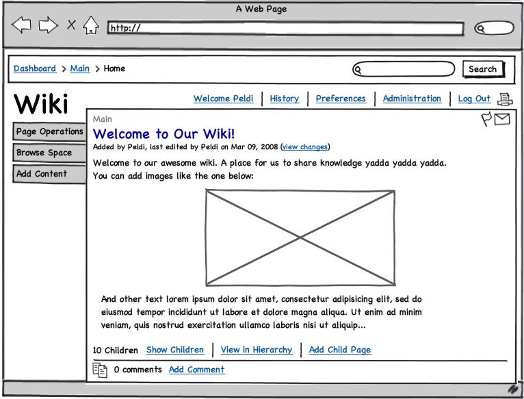

# Spoonacular Recipes

A simple project demonstrating usage of an external API to display data on the web page using HTML, CSS and JavaScript.

Data is being fetched through Spoonacular's API and rendered into a responsive design.

Current setup pulls 10 European cuisine meals and renders their titles, images and descriptions including the ingredient and nutrient breakdown.

# Responsive Design Guidelines

We can separate the page into sections which we need to take into consideration:

- Navigation top part (breadcrumbs & search)
- Navigation bottom part (page links)
- Left sidebar navigation
- Page content

## Navigation top part

Breadcrumbs are essential in full browser view, but not so much on mobile. Especially if they take up a lot of space, or even if they wrap into multiple lines. Depending on the website's "depth" we can choose a couple of different routes. If breadcrumbs take up too much space, we can remove them altogether in mobile view. Alternatively, we can opt to show only the last two levels.

The search bar can be redesigned in a few different ways. The Search button's size could be changes so it can fit inside of the search box, or it can be removed completely. If the button is removed the search functionality could be implemented asynchronously as the user types or triggered through form submitting without the button (pressing ENTER on the physical keyboard for desktop, or virtual keyboard on mobile devices). Alternatively, the whole search bar can be removed in mobile view and its functionality could be moved inside of the navigation dropdown or to a search dedicated page. An example of this is Instagram's Explore page which implements search bar in mobile view.

## Navigation bottom part

Page links are traditionally moved into a "hamburger" dropdown menu in mobile view. Putting all page links behind a single button has its own issues - it hides navigation options from the user and increases the number of clicks to get to a desired link. Apart from that, the menu button is usually put in one of the corners on top of the page which is not conveniently placed for mobile browsing.

An increasing number of websites is starting to take a different approach - page links are usually being switched for icons in mobile view and moved to the bottom of the page for easier thumb access. If a "hamburger" type of menu is being used it is also moved to one of the bottom corners and it is used alongside a regular navigation menu which shows the most important links which we don't want to hide from the user.

Good example of the best practice for this use-case would be Netflix. Its mobile app has a navigation menu that is moved to the bottom of the page. Menu items feature prominent icons and one of them is the infamous "hamburger" icon which opens a separate menu with less important options when clicked on.

## Left sidebar navigation

Having a sidebar menu always threatens to take up a significant portion of page content. Because of this, sidebar menus are either completely avoided, or they are implemented with a "collapse" button.

Good examples of this are GitHub which removes sidebar menus on pages where it isn't needed and Atlassian's Jira which features a collapsible menu.

## Page content

We almost never want to remove any parts of the main page content in mobile view, but we do want to display it differently depending on the device being used.

Content separated into multiple columns is usually being collapsed into one column on smaller screen sizes. We want to use as much of the screen space as we can, so page elements are usually set to cover 100% of the page width. This includes text and images, and sometimes buttons and form elements as well.

Designing content for mobile view also offers an opportunity to reconsider separation between page elements. For easier text readability - vertical spacing, font size and line height can be increased. Alternatively - vertical spacing can be decreased to fit more non-text content into the view. This is a practice used, for example, by YouTube and Instagram, to promote faster content consumption.
